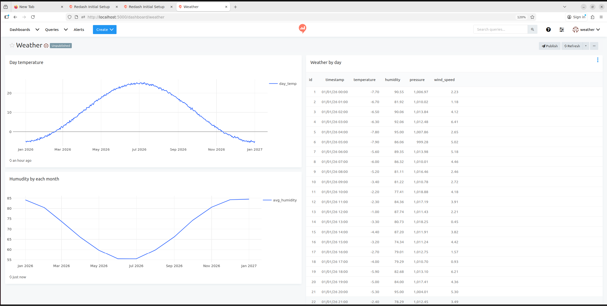

# Data Generator

## Требования
- Git
- Docker
- Docker Compose

---

## I. Установка и запуск

### 1. Клонирование репозитория
```bash
git clone https://github.com/eternalsunset671/data_generator.git
```

### 2. Переход в каталог проекта
```bash
cd data_generator
```

### 3. Настройка переменных окружения
Создаем файл `.env` на основе примера:
```bash
cp .env.example .env
```

### 4. Инициализация проекта
Назначаем права на выполнение и запускаем инициализационный скрипт:
```bash
chmod +x init_project.sh
./init_project.sh
```

---

## II. Доступ к приложению

После успешного запуска Redash будет доступен по адресу:
[http://localhost:5000](http://localhost:5000)

При подключении к PostgreSQL из Redash:
- Параметры подключения берутся из файла `.env`.
- **Host:** `db` (используем имя контейнера с PostgreSQL)

---

## III. SQL-запросы к БД

```sql
-- 1. Погода за текущий день
SELECT *
FROM weather_data
WHERE timestamp::date = NOW()::date;

-- 2. Средняя дневная температура
SELECT
  date_trunc('day', timestamp) AS day,
  AVG(temperature) AS day_temp
FROM weather_data
GROUP BY day
ORDER BY day;

-- 3. Среднемесячная влажность
SELECT
  date_trunc('month', timestamp) AS month,
  AVG(humidity) AS avg_humidity
FROM weather_data
GROUP BY month
ORDER BY month;
```

---

## IV. Итоговый дашборд
Итоговый дашборд для упомянутых SQL-запросов:


